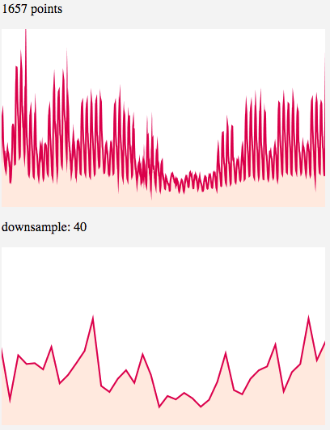

# Line

[](https://badge.fury.io/js/simple-line-chart)

Dead simple line chart in webgl. **[Demo](https://codesandbox.io/s/0pq5v6j1qp?fontsize=14)**


## Installation

With npm: `npm install --save simple-line-chart`

## Simple Example

Html(Require a 'width' and 'height'. You could set it with JavaScript):

```
<canvas width="600" height="320"></canvas>
```

JavaScript:

```
import line from "simple-line-chart";

const canvas = document.querySelector("canvas");
// Set the canvas size if necessary
// canvas.width = 600
// canvas.height = 320

line({
  canvas,
  data: [100, 200, 300, 200, 400, 100]
});
```

## Highlights

- Due to limitations of the OpenGL Core Profile on most platforms, the maximun line width is not constant(mostly is 1.0). So instead of drawing lines, use triangles to simulate the line and render them as regular buffergeometries.


- To improve 2D canvas resolution by setting its display size 2x as the size of its drawing buffer. That removes a lots jagged edges(aka aliasing) from the result.

- Internally this lib implemented LTTB data downsampling algorithm and use it for better visualisation output. LTTB is short for Largest Triangles Three Buckets, which is introduced on **Sveinn Steinarsson**'s paper [Downsampling Time Series for Visual Representation](https://skemman.is/bitstream/1946/15343/3/SS_MSthesis.pdf). Check it out for more information.


## API

```
function line(options: Options): Line
```

### Interactive

By default the chart will follow your mouse movement and highlight current value. You can turn it off by `interactive: false`. Additionally, you are able to bind `onHover` and `onLeave` callbacks in case you need them.


```
line({
  canvas: document.querySelector("canvas"),
  data: [100, 200, 300, 200, 400, 100],
  interactive: boolean, // Optional. Default is true
  onHover: (value: number) => {}, // Optional. Require 'interactive' to be true
  onLeave: () => {} // Optional. Require 'interactive' to be true
});
```

### Data Downsampling

To turn off the optimization and get the original visualisation, you could set `downsample: false`.
On the other hand, if you don't set it to `downsample: true`(this is the default option), instead set a number for it, you are setting the threahold you expect from the output.

For example:

```
line({
  canvas: document.querySelector("canvas"),
  data: [...], // Thousands of points here
  downsample: 40 // Expect only 40 points get rendered
});
```



### License

MIT ([Chuang Yu <cyu9960@gmail.com>](https://github.com/cyyyu))
