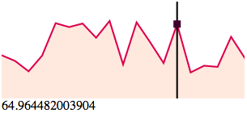
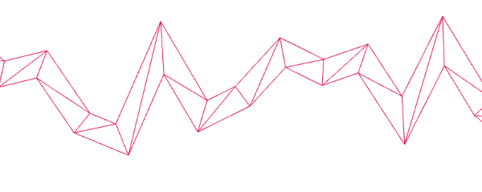
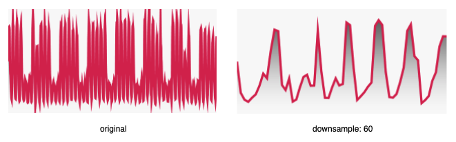
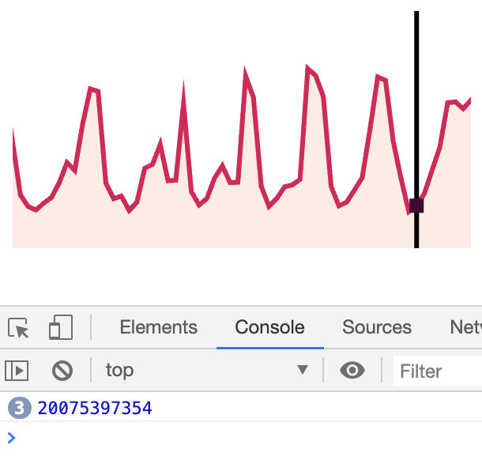

# Line

[](https://badge.fury.io/js/simple-line-chart)

Dead simple line chart in webgl. <a href="https://codesandbox.io/s/0pq5v6j1qp?fontsize=14" target="_blank">Demo</a>



## Install

`$ npm install --save simple-line-chart`

## Simple Example

```javascript
import line from "simple-line-chart";

line({
  canvas: document.querySelector("canvas");,
  data: [100, 200, 300, 200, 400, 100]
});
```

## Api

`line(options: Options): Line`

```typescript
/* All available options */
interface Options {
  canvas: HTMLCanvasElement; // The canvas to render to
  data: Data[]; // check out Data type definition below
  interactive?: boolean; // default true
  onHover?: (value: Data) => void;
  onLeave?: () => void;
  downsample?: boolean | number; // default true
  paddingX?: number; // default 10
  paddingY?: number; // default 10
}
/**
 * Data type could be one or two dimensional array
 * For example:
 * [100, 250, 70, 180...]
 * or
 * [[2010, 100], [2011, 250], [2012, 70], [2013, 180]...]
 * */
type Data = Array<number> || Array<[number, number]>
```

## Highlights

### How the line is drawn?

Due to limitations of the OpenGL Core Profile on most platforms, the maximun line width is not constant(mostly is 1.0). So instead of drawing lines, use triangles to simulate the line and render them as regular buffergeometries.



### Resolution

To improve 2D canvas resolution by setting its display size 2x as the size of its drawing buffer. That removes a lots jagged edges(aka aliasing) from the result.

### Downsampling

Internally this lib implemented LTTB data downsampling algorithm and use it for better visualisation output. LTTB is short for Largest Triangles Three Buckets, which is introduced on **Sveinn Steinarsson**'s paper [Downsampling Time Series for Visual Representation](https://skemman.is/bitstream/1946/15343/3/SS_MSthesis.pdf). Check it out for more information.

To turn off the optimization and get the original visualisation, you could set `downsample: false`.
On the other hand, if you don't set it to `downsample: true`(this is the default option), instead set a number for it, you are setting the threahold you expect from the output.

For example:

```javascript
line({
  // ...
  canvas: document.querySelector('#canvas-original')
  downsample: false
});

line({
  // ...
  canvas: document.querySelector('#canvas-downsampled')
  downsample: 60 // default: true
});
```



### Interactive

By default the chart will follow your mouse movement and highlight current value. You can turn it off by `interactive: false`. Additionally, you are able to bind `onHover` and `onLeave` callbacks in case you need them.

```javascript
line({
  // ...
  /* uncomment this line to make it not respond to mouse hover event */
  // interactive: false
  onHover(d) { console.log(d) }
})
```



### License

MIT ([Chuang Yu <cyu9960@gmail.com>](https://github.com/cyyyu))
