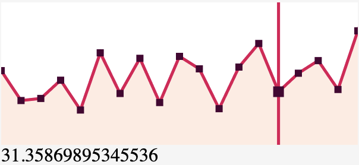

# Line

[](https://badge.fury.io/js/simple-line-chart)

Dead simple line chart in webgl.



### Demo

Please visit: [demo](https://cyyyu.github.io/projects/simple-line-chart/)

### Usage

`npm install --save simple-line-chart`

```
import line from "simple-line-chart";

line({
  canvas: document.querySelector("canvas"),
  data: [100, 200, 300, 200, 400, 100],
  interactive: true, // Optional
  onHover: value => {}, // Optional. Require 'interactive' to be true
  onLeave: () => {} // Optional. Require 'interactive' to be true
});
```

### License

MIT ([Chuang Yu <cyu9960@gmail.com>](https://github.com/cyyyu))
