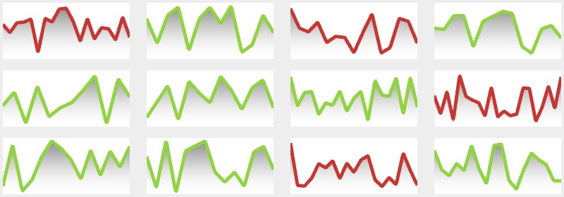

# Line

[](https://badge.fury.io/js/simple-line-chart)

Dead simple line chart in webgl. <a href="https://codesandbox.io/s/0pq5v6j1qp?fontsize=14" target="_blank">Demo</a>

`4.8KB` after gzip.



## Install

`$ npm install simple-line-chart`

## Simple Example

```javascript
import line from "simple-line-chart";

line({
  canvas: document.querySelector("canvas"),
  data: [100, 200, 300, 200, 400, 100]
});
```

## Api

`line(options: Options): Line`

```typescript
/* All available options */
interface Options {
  canvas: HTMLCanvasElement; // the canvas to render to. Required.
  data: Data[]; // check out Data type definition below. Required.
  downsample?: boolean | number; // default true.
  color?: {r: number, g: number, b: number}; // line color in rgb.
  backgroundColor?: {r: number, g: number, b: number}; // background color in rgb.
  onHover?: (data: {x:number, y:number}) => void; // interactive
}
/**
 * Data type could be one or two dimensional array
 * For example:
 * [100, 250, 70, 180...]
 * or
 * [[2010, 100], [2011, 250], [2012, 70], [2013, 180]...]
 * */
type Data = Array<number> || Array<[number, number]>
```

## Highlights

### How the line is drawn?

Due to limitations of the OpenGL Core Profile on most platforms, the maximun line width is not constant(mostly is 1.0). So instead of drawing lines with GL_LINES, we build line segments with triangles, the so called Triangulated Lines.


### Downsampling

Internally this lib implemented LTTB data downsampling algorithm and use it for better visualisation output. LTTB is short for Largest Triangles Three Buckets, which is introduced on **Sveinn Steinarsson**'s paper [Downsampling Time Series for Visual Representation](https://skemman.is/bitstream/1946/15343/3/SS_MSthesis.pdf). Check it out for more information.

To turn off the optimization and get the original visualisation, you could set `downsample: false`.
In addition, this option allows you to set a threahold for output points. You can do that by providing a number.

For example:

```javascript
line({
  // ...
  canvas: document.querySelector('#canvas-original')
  downsample: false
});

line({
  // ...
  canvas: document.querySelector('#canvas-downsampled')
  downsample: 60 // the output will contain less than 60 points.
});
```


### License

MIT ([Chuang Yu <cyu9960@gmail.com>](https://github.com/cyyyu))
